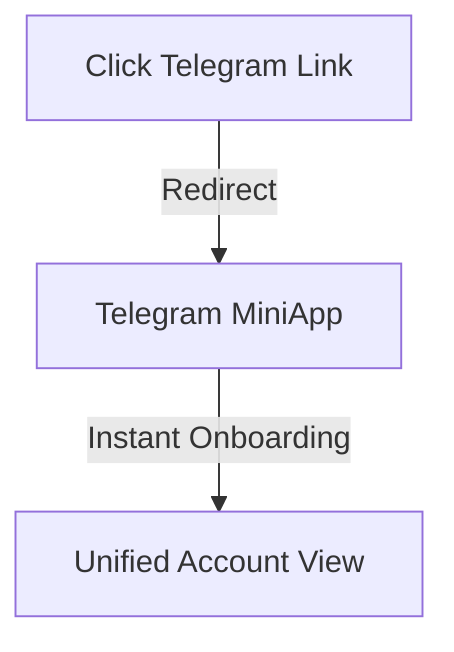
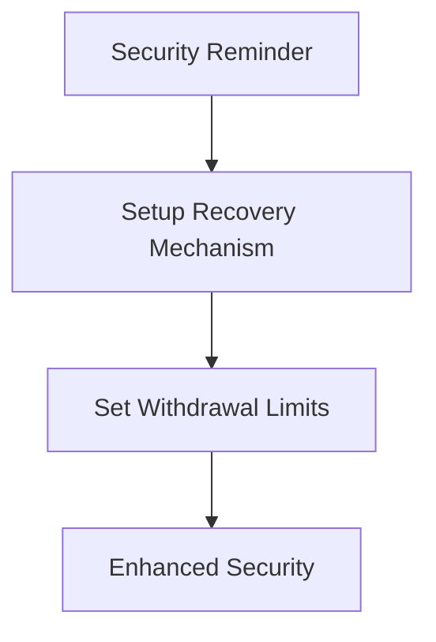
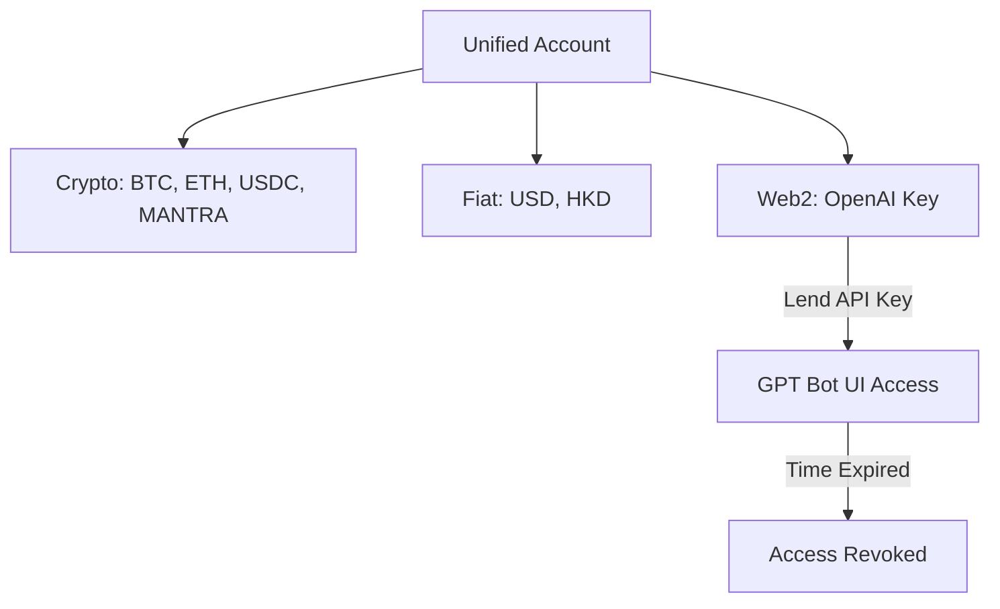
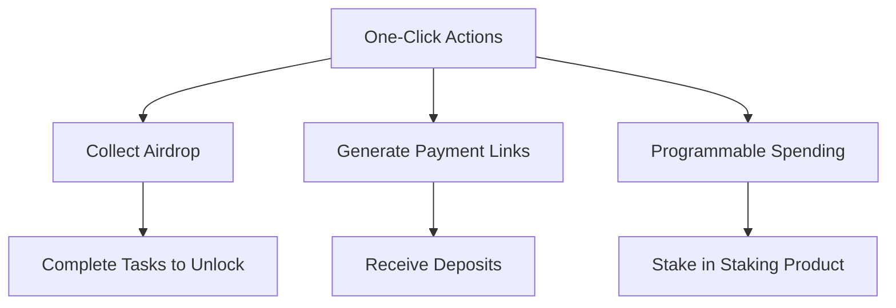

# Sphere: Secure & Unified Asset Management.

Sphere is an innovative Account Abstraction (AA) wallet seamlessly integrated into Telegram as a Mini App. It offers a secure and user-friendly way to manage both blockchain assets and Web2 secrets, eliminating the complexities traditionally associated with private keys and seed phrases.

## Key Features:

**1. Advanced Key Management:**

- Sphere utilizes **Shamir Secret Sharing (SSS)** to split user keys into multiple shards.
- Each shard is securely stored on different nodes within the network, enhancing security and resilience.
- Users benefit from a simplified experience, as the network handles the complexities of key management, removing the need to safeguard private keys or seed phrases.

**2. Unified Multi-Chain Account:**

- Provides a single interface to view and manage assets across various blockchain networks.
- Simplifies portfolio management for users active on multiple chains.

**3. Secure Web2 Asset Storage:**

- Extends its secure infrastructure beyond crypto assets to store valuable Web2 secrets, such as:
  - OpenAI API keys
  - Airwallex keys
  - Polymarket accounts
  - Potentially any other web2 secret.

**4. Web2 Asset Lending Marketplace:**

- Introduces a novel marketplace for lending and borrowing Web2 assets.
- **Lenders:** Can securely lend access to their keys (e.g., OpenAI, Airwallex, Polymarket) without losing control. They provide permissioned usage, not ownership.
- **Borrowers:** Gain access to use these assets through a controlled interface.
- This unlocks new possibilities, such as using Web2 keys as collateral in the future.

**5. Staking Opportunities:**

- Offers staking vaults yielding attractive Annual Percentage Yields (APY) of **11-13%**.
- Leverages Sphere's premium investment strategies to generate returns for stakers.

**6. Growth & Acquisition:**

- Employs a customer acquisition engine driven by airdrops and the native **Sphere token**.

In essence, Sphere provides a robust, secure, and unified platform for managing digital assets (both Web3 and Web2), simplifies user experience through AA and advanced key management, and introduces innovative DeFi concepts like Web2 asset lending.

## 🚀 Instant Onboarding (0:00 - 1:00)

1. **Click the Telegram Link**
   - Users receive a link and click it.
   - Instantly redirected to the Telegram MiniApp in **<5 seconds**.
   - No sign-up, no loading times—**instant onboarding**.

## 🔒 Security Setup Reminder (1:00 - 1:30)

2. **Security Notification**
   - Users receive a notification to set up security.
   - Setup includes:
     - Recovery Mechanism
     - Withdrawal Limits
   - Reinforces **safety and user control**.

## 🌍 Unified Multichain & Web2 Assets (1:30 - 3:00)

3. **Explore Unified Account**
   - One tab for everything:
     - **Crypto:** BTC, ETH, USDC, MANTRA
     - **Fiat:** USD, HKD
     - **Web2 Assets:** OpenAI API Key, others
   - Example Actions:
     - Send **crypto** → Receiver gets **HKD**.
     - Send **HKD** → Receiver gets **stablecoins**.
     - Lend OpenAI API Key → Borrower interacts with GPT UI **without seeing the key**.
     - **Access revoked** once borrowed time expires.

## ⚡ One-Click Suite (3:00 - 5:00)

4. **One-Click Actions**
   - **Airdrop Collection**
     - Click a link → Get locked tokens → Complete tasks → Unlock tokens.
   - **Click to Collect Links**
     - Create a unique link instead of needing a recipient address.
     - Send the link to the recipient.
     - When the recipient clicks the link, funds are automatically transferred from your account.
   - **Payment Links**
     - Generate a payment link and receive deposits from others.
   - **Programmable Spending**
     - Lend crypto/money with spending conditions (e.g., stake in staking product).

## 🎉 Conclusion

- **Instant onboarding with a single click**.
- **Security-first approach**.
- **Unified, seamless asset management**.
- **Powerful one-click features for effortless transactions**.

---

👉 **Experience Sphere Now!** 🚀
