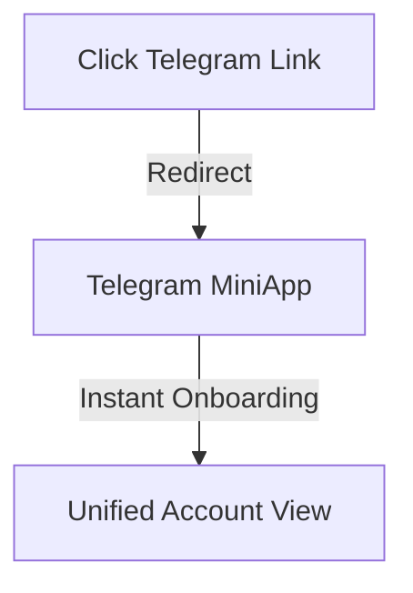
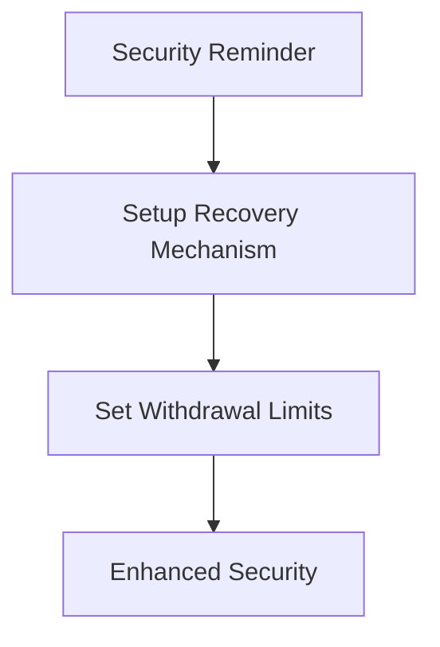
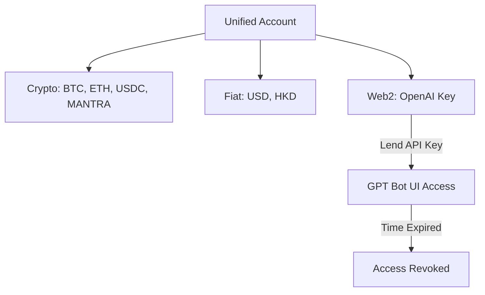
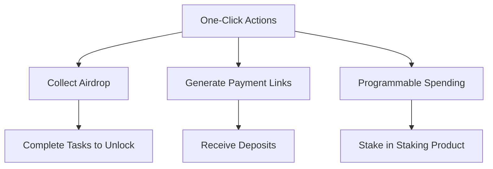

# Sphere Demo

## 🚀 Instant Onboarding (0:00 - 1:00)
1. **Click the Telegram Link**
   - Users receive a link and click it.
   - Instantly redirected to the Telegram MiniApp in **<5 seconds**.
   - No sign-up, no loading times—**instant onboarding**.

## 🔒 Security Setup Reminder (1:00 - 1:30)
2. **Security Notification**
   - Users receive a notification to set up security.
   - Setup includes:
     - Recovery Mechanism
     - Withdrawal Limits
   - Reinforces **safety and user control**.

## 🌍 Unified Multichain & Web2 Assets (1:30 - 3:00)
3. **Explore Unified Account**
   - One tab for everything:
     - **Crypto:** BTC, ETH, USDC, MANTRA
     - **Fiat:** USD, HKD
     - **Web2 Assets:** OpenAI API Key, others
   - Example Actions:
     - Send **crypto** → Receiver gets **HKD**.
     - Send **HKD** → Receiver gets **stablecoins**.
     - Lend OpenAI API Key → Borrower interacts with GPT UI **without seeing the key**.
     - **Access revoked** once borrowed time expires.

## ⚡ One-Click Suite (3:00 - 5:00)
4. **One-Click Actions**
   - **Airdrop Collection**
     - Click a link → Get locked tokens → Complete tasks → Unlock tokens.
   - **Payment Links**
     - Generate a payment link and receive deposits from others.
   - **Programmable Spending**
     - Lend crypto/money with spending conditions (e.g., stake in staking product).

## 🎉 Conclusion
- **Instant onboarding with a single click**.
- **Security-first approach**.
- **Unified, seamless asset management**.
- **Powerful one-click features for effortless transactions**.

---

👉 **Experience Sphere Now!** 🚀
